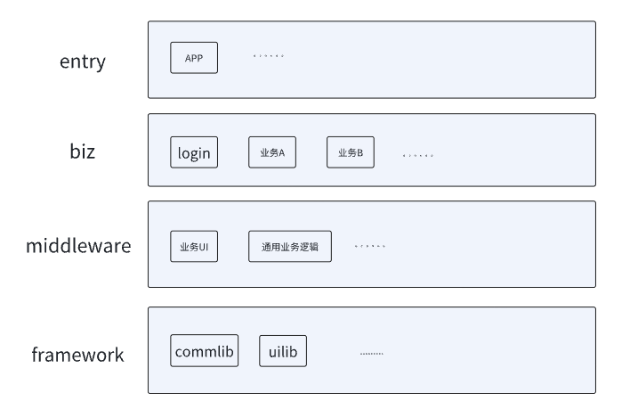

## 鸿蒙脚手架搭建日志
> 2024.1.9更新

### 瞎说两句
- 一个APP不管使用什么底座和开发语言，思想上总会有很多相通的地方，比如功能上都需要有统一的日志组件，存储框架，网络请求框架，web容器等，UI上可能有统一封装的Toast，Dialog，各种tab,banner等。
- 脚手架的意义是致力于一些基础且通用的组件和功能的封装，既能满足上层业务快速startup，又能进行统一维护，尽可能降低后期混乱程度。

### 再瞎说两句
一般来说客户的软件架构可以遵循以下分层，视发展规模，团队人员等动态调整，但是八九不离十，毕竟作为一个商业项目，没有一点组件化影子都不好意思和别人打招呼ORZ。

    简单说明下：

        - framework属于业务无关，基础工具类，通用UI等
        - middleware属于业务相关的通用组件，通用UI，通用逻辑
        - biz属于具体业务组件，比如登录模块，业务A，业务B等
        - entry最上层，一般只包含一些全局初始化，或者不好归类于具体业务的，或者干脆只是一个壳子

### 项目说明（持续更新）
以目前的了解，华为的项目结构依赖和安卓类似，但是又摒弃了gradle，但是模块化和组件化的概念还是一样的，鸿蒙lib库可打包称为har的包供其他工程依赖，类似安卓的aar，且也有远程仓库的概念，所以还是通过module拆开
#### framework
##### commlib 基础工具类库
    - log: log工具类MLog,支持统一开关，统一tag，切换hilog或者console，支持打印行号（暂时注释掉了），配置通过LogOptions配置
    - toast: 工具类MToast,方便后续统一管理
    - KV存储： 工具类MPreferencesUtil，类似安卓的SP，简单且常用的本地持久化，但是这个返回的是异步的promise
    - event: 类似广播，eventbus等，华为自己封装好了一套，定义action就行
    - network: 封了两套，一套是基于鸿蒙自己http的，一套是基于axios的，推荐axios，明显功能和可用性会更好，axios也是排第一的三方库
    - loading: 基于event封装了loading的事件，也就是说任何页面都可以调起全局loading页，很多时候还是有点用
    ......

##### uilib 基础UI库
    - MLoadingDialog： 全局的通用loading，暂不支持定制UI，也是commlib中loading事件的被调用方
    - MDialogUtil：控制各种dialog可以在这里收口，目前只有alertDialog
    - MCommDialog： 通用弹窗，标题内容确定取消那种，同时支持自己定义view塞进来

#### entry
    - 上面的使用示例都写在这里
    - 试了一下router的页面跳转
    - 试验了一下web容器加载，并且测试了下bridge，以及用一个BaseViewModel去实现类似interface的功能，这一块待封装成通用web组件

    
